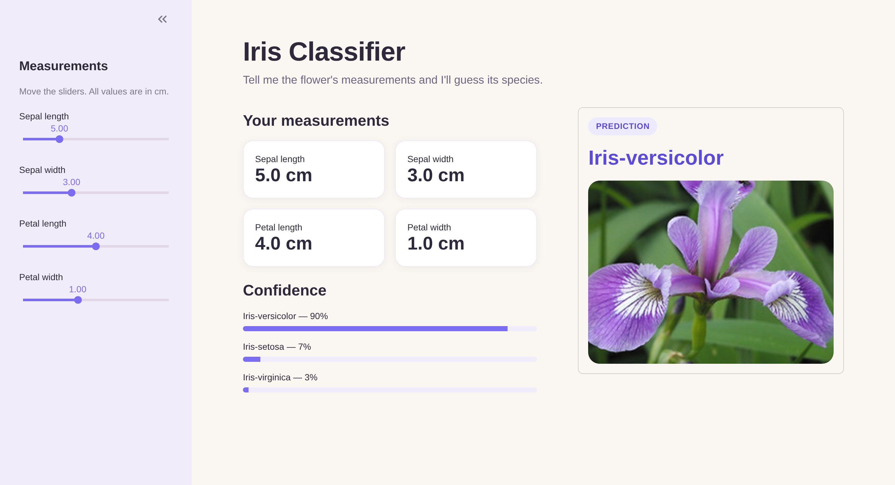

# Iris Flower Classifier

A Streamlit web app that predicts the species of an iris flower (setosa, versicolor or virginica) from four measurements, using a scikit-learn model trained on the classic Iris dataset.

**Live demo:** <your Streamlit app URL>



## Features

- Sidebar sliders for sepal and petal length and width
- Live prediction that updates as you move the sliders
- Confidence score for each species
- Photo of the predicted species

## Tech stack

Python 3.12 · Streamlit · scikit-learn · Pillow

## Run locally

```bash
git clone git@github.com:shweyeewinn/iris_classifier.git
cd iris_classifier
pip install -r requirements.txt
streamlit run flowers.py
```

Then open http://localhost:8501 in your browser.

## Project structure

```
├── .streamlit/config.toml   # app theme
├── flowers.py               # Streamlit app
├── iris_model.pkl           # trained model
├── *.jpg                    # species images
└── requirements.txt         # pinned dependencies
```

## Model

<model type, e.g. Logistic Regression>, trained on the 150-sample Iris dataset with the four measurement features. Test accuracy: <your accuracy>.

## Author

Shwe Yee Winn · [GitHub](https://github.com/shweyeewinn)